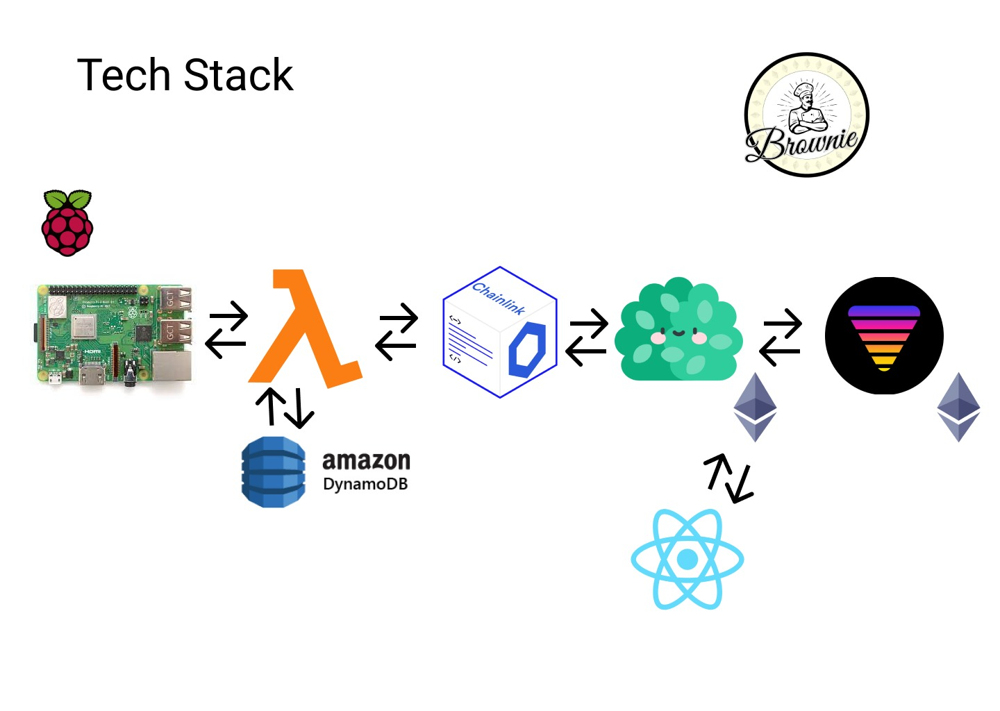

# Chainlink Hackathon

## Description

Shrub aims to bring catastrophic insurance policies to the DeFi space using smart contracts and the Ethereum network blockchain. A smart contract representing the policy for a binary outcome natural event, such as an earthquake, issues two separate event tokens to users in exchange for DAI. These two tokens, TokA and TokB represent either side of the insured event happening. For example, TokA would represent an earthquake taking place in a predefined area within a predefined timeframe, and TokB would represent an earthquake not happening within those predefined parameters. When the policy is over (i.e. either the earthquake happens, or the timeframe expires), the token representing the outcome is worth 100% of the value the tokens were initially issued for, and the other token is worth 0% of that value. The valuable tokens can then be exchanged with the smart contract for the original DAI paid to issue the tokens.

The two tokens can be traded between users on a decentralized exchange. Users will trade the tokens rationally based on the likelihood of the certain event happening, and a premium price will naturally be priced in for those who want insurance on the event happening. In this way, a decentralized insurance market is created.

The Chainink protocol is used to input the occurrence of the insured event into the blockchain. In this hackathon, an accelerometer running on a Raspberry Pi is used to simulate an earthquake detector. If the accelerometer is shaken, a POST request changes an API endpoint to read that an earthquake has occurred. Our Chainlink node reads that API and updates our smart contract. Ideally, the Chainlink node would be reading the API of official and decentralized earthquake trackers (or any relevant catastrophic event tracker).

We also leverage 88mph to earn interest on the DAI submitted by the users while the contract is active. When the contract expires and the users can redeem either their A or B tokens for DAI, they can earn additional DAI from the interest earned on 88mph. 
## Architecture Diagram

## Smart Contracts


### The Manager Contract

The manager contract keeps track of three important state variables:

- The token price: how much a pair of A/B tokens costs in Wei.

- Tokens sold: how many pairs of A/B token have been issued.

- The state of the contract: Has the insured event happened, has the pre-specified contract time expired, or is the contract still active?

```
uint256 public tokenPrice;
uint256 public tokensSold;
uint256 public state;
```

The manager contract is responsible for three things:

- Issuing A and B tokens to users in exchange for the DAI. Users can specify how many pairs of A/B tokens they want to purchase. The token price is specified by the tokenPrice state variable when the contract is initialized. Once it is verified that the user has enough DAI to purchase tokens, the Mint method in the Token smart contract is is called (shown below)

```
function  buyTokens(uint256 _numberOfTokens) public  payable {
require(state == 0);
//Check to make sure that buyer has allowed stablecoin transfer
uint _allowance = stableCoin.allowance(msg.sender, address(this));
//make sure value matches tokens requested
require(_allowance == SafeMath.mul(_numberOfTokens, tokenPrice));
require(stableCoin.transferFrom(msg.sender, address(this), _allowance));
require(AtokenContract.mint(msg.sender, _numberOfTokens));
require(BtokenContract.mint(msg.sender, _numberOfTokens));
tokensSold += _numberOfTokens;
Sell(msg.sender, _numberOfTokens);
}
```

- Allowing users to redeem their valuable tokens in exchange for a DAI pay out once the insurance contract has come to an end. If the event has happened (state = 1), token A can be redeemed for DAI. If the pre-specified contract time has expired (state = 2), token B can be redeemed for DAI. Otherwise, the contract is still active (state = 0)

```
function  redeemExecute(address  payable redeem_address) internal {
// redeems Token A if state==1
if (state == 1){
uint _tokens_to_redeem = AtokenContract.balanceOf(redeem_address);
require(stableCoin.balanceOf(address(this))>=SafeMath.mul(_tokens_to_redeem, tokenPrice));
require(AtokenContract.adminTransfer(redeem_address, address(this), _tokens_to_redeem));
require(stableCoin.transfer(redeem_address, SafeMath.mul(_tokens_to_redeem,tokenPrice)));
}
// redeems Token B if state == 2
else  if (state == 2){
uint _tokens_to_redeem = BtokenContract.balanceOf(redeem_address);
require(stableCoin.balanceOf(address(this))>=SafeMath.mul(_tokens_to_redeem, tokenPrice));
require(BtokenContract.adminTransfer(redeem_address, address(this), _tokens_to_redeem));
require(stableCoin.transfer(redeem_address, SafeMath.mul(_tokens_to_redeem,tokenPrice)));
}
// skips redemption if contract is still active
else { // state=0
require(false, "contract still active");
}
}
```

- Keeping track of the state of the contract (i.e. whether the catastrophic event has happened or not) by requesting the state from the Chainlink node. Ideally, an external trigger would be used to initiate the Chainlink job. However, in the interest of time, we implemented a system where the Chainlink jobs is activated and the state of the contract is checked when a user tries to redeem tokens.

```
function redeem(Token _token, uint256 _numberOfTokens) public payable {
if (state == 0){
bytes32 _cur_request_id = requestState(address(0x4712020cA7E184C545FD2483696c9dC36cb7c36a),"ca0d86424890466f856de3e868087f81");
RedeemRequest memory _cur_request = RedeemRequest(msg.sender, _numberOfTokens, _token);
redeem_book[_cur_request_id] = _cur_request;
} else 
redeemExecute(_token, _numberOfTokens, msg.sender);
}
}
function requestState(address _oracle, string memory _jobId)
public returns (bytes32 requestId)
{
Chainlink.Request memory req = buildChainlinkRequest(stringToBytes32(_jobId), address(this), this.fulfillState.selector);
req.add("get", "https://i1ihiyjpu8.execute-api.us-west-1.amazonaws.com/default/test_api");
req.add("path", "state");
// Returns ID of request
return sendChainlinkRequestTo(_oracle, req, ORACLE_PAYMENT);
}
function fulfillState(bytes32 _requestId, uint256 _state)
public
recordChainlinkFulfillment(_requestId)
{
emit RequestStateFulfilled(_requestId, _state);
state = _state;
// Load redeem request
RedeemRequest memory _cur_redeem = redeem_book[_requestId];
Token _token = _cur_redeem.tokenContract;
uint _numberOfTokens = _cur_redeem.num_tokens;
address payable _redeem_address = _cur_redeem.addr;
redeemExecute(_token, _numberOfTokens, _redeem_address);
}
```

### The Token Contract

- The token contract is used to create and manage the A and B tokens representing the two sides of insurance policies
- These tokens are standard ERC20 tokens with all the relevant methods but include several additional methods for use in our protocol
- The Mint method allows the Manager contract to mint tokens 

```
function  mint(address _to, uint256 _value) public  returns (bool) {
require(msg.sender == token_admin);
balances[_to] = balances[_to].add(_value);
totalSupply += _value;
emit  Transfer(address(0), _to, _value);
return  true;
}
```
- The Admin Transfer contract allows only the Manager contract to transfer A and B tokens
 ```
function  adminTransfer(address _from, address _to, uint256 _value) public  returns (bool) {
require(msg.sender == token_admin);
_transfer(_from, _to, _value);
return  true;
}
```

### The Test88MPH Contract

- This contract allows for DAI to be sent to 88mph to acrew interest, and then to be withdrawn once users redeem their tokens
- We used our own test DAI token and our own test contract that mimics the functionality of the 88mph DInterest Contrac
- These early withdraw function is called automatically when the state of the contract changes

```
function earlyWithdraw(uint256 depositID, uint256 fundingID) external {
require (deposit_records[msg.sender] > 0, "no record of deposit from this sender");
uint256 withdraw_amount = deposit_records[msg.sender];
require (stableCoin.transfer(msg.sender, withdraw_amount));
deposit_records[msg.sender] = 0;
}
```
- The withdraw function can be called at any time by the Manager contract. This allows the manager contract to deposit and withdraw based on the length of the contract and other relevant parameters, such as the current interest rate, to maximize the amount of interest earned
```
function withdraw(uint256 depositID, uint256 fundingID) external {
require (deposit_records[msg.sender] > 0, "no record of deposit from this sender");
uint256 interest = SafeMath.div(deposit_records[msg.sender], 10);
uint256 withdraw_amount = deposit_records[msg.sender] + interest;
require (stableCoin.transfer(msg.sender, withdraw_amount));
deposit_records[msg.sender] = 0;
}
```
